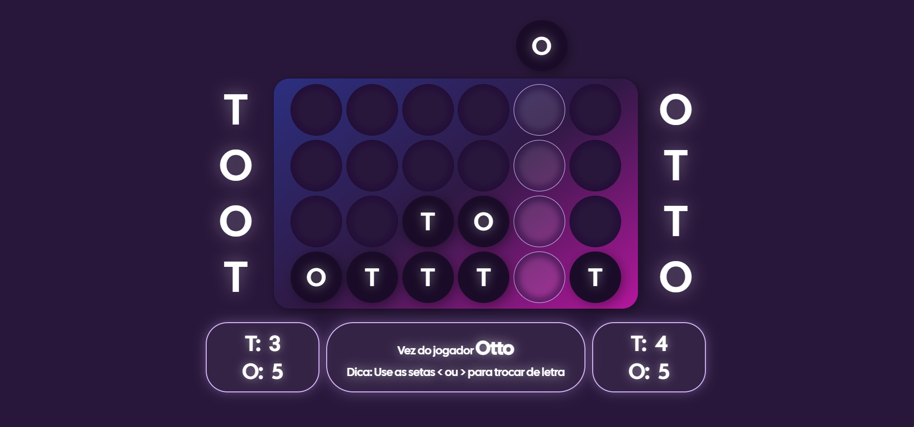

# Toot and Otto 🎯

**Toot and Otto** is a board game, developed as part of a college assignment to practice DOM manipulation and interactive features in web development.

## 📸 Preview

---

## 📌 Rules of the game
- Toot and Otto is played on a **4×6 board**.
- The board starts empty, with spaces at the top of each column to insert pieces.
- There are two types of pieces: **T** and **O**.  
  Each player has six Ts and six Os available.
- One player is named **TOOT** and the other **OTTO**. TOOT plays first.
- On each turn, a player chooses which piece (T or O) to drop into a column:
  - The piece will fall to the **lowest available row** in that column.
  - If the column is full, the move is invalid and a message is displayed.
- Players alternate turns until:
  - A sequence spelling **TOOT** or **OTTO** is formed horizontally, vertically, or diagonally:
    - If a player forms their own name, they win.
    - If a player completes the opponent’s name, the opponent wins.
  - If both names are completed simultaneously or no pieces remain with no winner, the game ends in a draw.

---

## ✨ Features implemented
✅ **4×6 board generation**, showing remaining pieces and a message field.  
✅ **Valid move checks:** pieces fall to the lowest empty space; columns cannot overflow.  
✅ **Turn management:** message updates after each valid move.  
✅ **Winning & draw detection:** automatically checks for TOOT or OTTO after every move and announces the result.  

---

## 🚀 Technologies
- **HTML** for structure  
- **CSS** for styling and visual feedback  
- **JavaScript** for game logic and DOM manipulation

---

## ▶️ How to run
1. Clone this repository.
2. Open `index.html` in your browser.

---

👩‍💻 *Developed by Eduarda Rocha (https://github.com/EduardaRFSousa/)*
